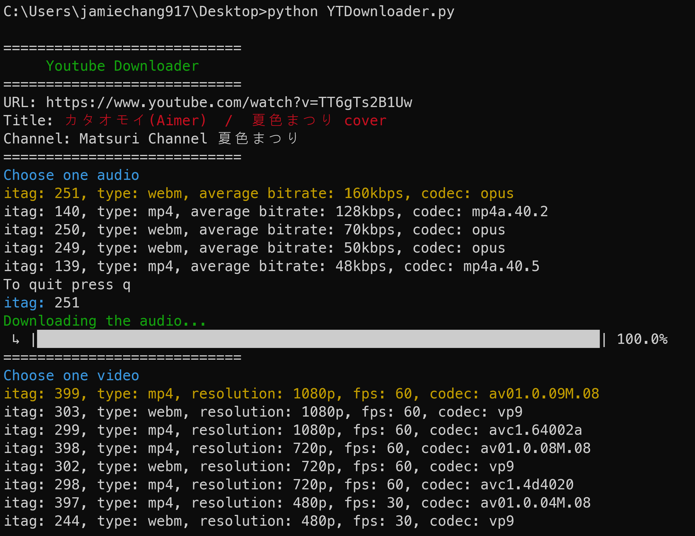

# YTDownloader
A simple downloader based on Pytube for Youtube videos 

## Installation
1. Install `pytube` package  
`pip install pytube`

2. Install FFmpeg  
You can found in the [FFmpeg official website](https://www.ffmpeg.org/). Install FFmpeg and make sure the environmental variables (`PATH`) includes the path of `ffmpeg.exe`.

3. Install `ffmpeg` package  
`pip install ffmpeg-python`

## Run the script
Edit the variables defined in the top part of `YTDownloader.py`
* `FFMPEG_PATH`: The absolute path of `ffmpeg.exe`.
* `SAVE_PATH`: The absolute path the output file will save in.
* `LINK`: URL of the video
* `SAVE_INTERMEDIATED_FILE`: default is false, if it is true, the seperated audio and video files will not be deleted after the combination.  
  
Then you can run with `python YTDownloader.py`
